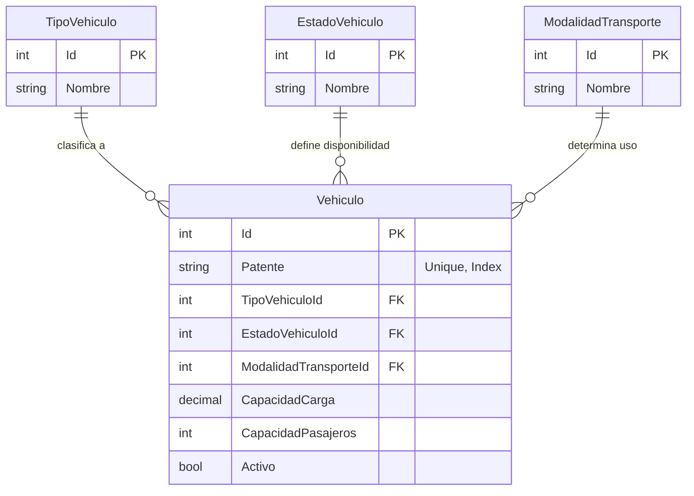

# Sistema de Transporte y Gestión de Flota: Arquitectura de Datos

> **Estado**: Fase 1 (Modelado Core) | **Tech**: SQL Server 2022, Docker, T-SQL

---

## 📋 Resumen Ejecutivo

Este proyecto modela el **núcleo de datos** de un sistema de transporte diseñado para escalar desde un inventario básico de flota hasta una plataforma operativa completa (gestión de conductores, monitoreo de viajes y auditoría).

El propósito de este repositorio no es simplemente "crear base de datos", sino demostrar **decisiones de arquitectura conscientes**, priorizando la **integridad referencial**, la **escalabilidad del esquema** y la **trazabilidad de datos** sobre la velocidad de implementación rápida. Se simula un entorno empresarial donde la calidad del dato es crítica.

---

## 🧐 El Problema que Aborda el Diseño

En el sector logístico, es común que la información de la flota comience dispersa en hojas de cálculo no estandarizadas. Esto escala rápidamente hacia problemas graves:
1.  **Datos Sucios**: Vehículos con marcas escritas de 5 formas diferentes ("Ford", "FORD", "F ord").
2.  **Duplicidad**: Mismo vehículo registrado dos veces con patentes mal formateadas.
3.  **Falta de Auditoría**: Imposibilidad de saber el estado real de la capacidad operativa (¿Cuántos camiones tengo disponibles *realmente*?).

**La Solución Arquitectónica:**
Diseñar una base de datos que actúe como una **Fuente de Verdad (Single Source of Truth)** estricta, utilizando esquemas para separar responsabilidades y catálogos para forzar la estandarización desde el nivel de datos.

---

## 🏗️ Decisiones de Arquitectura

### 1. Organización por Schemas (Namespaces)
En lugar de volcar todas las tablas en el esquema por defecto (`dbo`), se implementó una separación lógica:

| Schema | Propósito | Justificación |
| :--- | :--- | :--- |
| **`core`** | Entidades centrales del negocio (`Vehiculo`). | Aísla los datos transaccionales de alto valor. |
| **`catalogs`** | Tablas de referencia (`TipoVehiculo`, `Estado`). | Separa los datos de configuración/maestros que cambian poco. |
| **`tracking`** | *(Roadmap)* Datos de telemetría y GPS. | Anticipa el alto volumen de escritura segregándolo lógicamente. |

### 2. Catálogos vs. ENUMs
Se optó por tablas físicas en el esquema `catalogs` en lugar de usar `ENUMs` en el código de aplicación o `CHECK Constraints` rígidos.
*   **Por qué**: Permite agregar nuevos tipos de vehículos o estados sin requerir una migración de base de datos o un despliegue de código. Facilita la integración con herramientas de BI (PowerBI/Tableau) que pueden leer las etiquetas directamente.

### 3. Modelo Relacional Visual
A continuación se presenta el diseño actual de la Fase 1:



---

## 🧠 Decisiones Conscientes (Trade-offs)

Como arquitectos, decidir **qué NO hacer** es tan importante como qué hacer.

*   **No se modelaron usuarios/roles aún**: Se priorizó estabilizar el dominio del negocio (`Flota`) antes de acoplar un sistema de seguridad. La seguridad se manejará en un esquema `security` dedicado en la Fase 4.
*   **No hay "Soft Deletes" complejos**: Se utiliza una columna simple `Activo` (bit) en lugar de tablas de historial temporal por ahora, para mantener la simplicidad en las consultas iniciales.
*   **No se almacenan fotos en BLOBs**: El diseño contempla que las imágenes de los vehículos (tarjetas de circulación, fotos de estado) residirán en un Object Storage (S3/Azure Blob), guardando solo la referencia (URL) en la BD.

---

## 🗺️ Evolución del Modelo (Roadmap)

Este proyecto sigue una estrategia de implementación incremental:

### ✅ Fase 1 – Núcleo de Flota (Actual)
*   Centralización del inventario de vehículos.
*   Estandarización mediante catálogos.
*   Control de identidad (Patentes Unicas).

### 🚧 Fase 2 – El Factor Humano (En Progreso)
*   Entidad `Conductor` y `Licencias`.
*   Relación `Vehiculo-Conductor` (Asignaciones).
*   Historial de asignaciones.

### 🔮 Fase 3 – Operación y Observabilidad
*   Entidad `Viaje` y `HojaRuta`.
*   Tracking de eventos (Salida, Llegada, Incidente).
*   Integración con datos GPS.

---

## 💻 Despliegue Técnico

El entorno es 100% reproducible utilizando contenedores.

### Estructura del Repositorio
```text
/database
  ├── 01_schemas.sql    # Definición de Namespaces
  ├── 02_catalogos.sql  # Tablas Maestras
  └── 03_vehiculo.sql   # Tablas Core
/docs                   # Diagramas y ADRs
/infra                  # Docker Compose
```

### Quick Start
1.  **Clonar y configurar**:
    ```bash
    git clone https://github.com/tu-usuario/transporte-flota-database.git
    cp .env.example .env
    ```
2.  **Levantar SQL Server**:
    ```bash
    docker-compose -f infra/docker-compose.yml up -d
    ```
3.  **Desplegar Esquema**:
    Conectar a `localhost:1433` y ejecutar los scripts en orden numérico (01 -> 02 -> 03).
