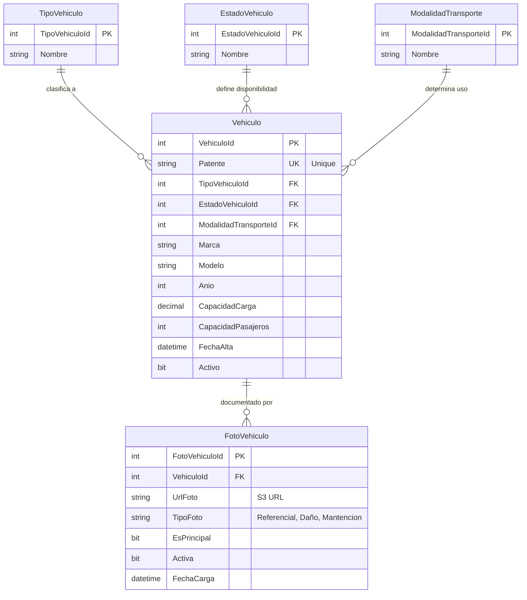
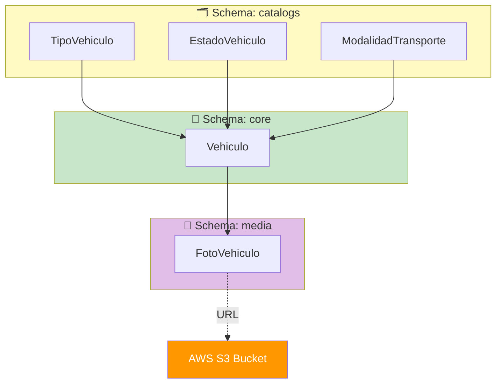

# Sistema de Transporte y Gestión de Flota: Arquitectura de Datos

> **Estado**: Fase 1 Completada + Extensión Media | **Tech**: SQL Server 2022, Docker, T-SQL

---

## 📑 Tabla de Contenidos

1. [Resumen Ejecutivo](#-resumen-ejecutivo)
2. [El Problema que Aborda](#-el-problema-que-aborda-el-diseño)
3. [Decisiones de Arquitectura](#️-decisiones-de-arquitectura)
4. [Modelo Relacional](#-modelo-relacional-completo)
5. [Decisiones Conscientes](#-decisiones-conscientes-trade-offs)
6. [Evolución del Modelo](#️-evolución-del-modelo-roadmap)
7. [Despliegue Técnico](#-despliegue-técnico)
8. [Business Intelligence](#-business-intelligence-demo)
9. [Conecta Conmigo](#-conecta-conmigo)

---

## 📋 Resumen Ejecutivo

Este proyecto modela el **núcleo de datos** de un sistema de transporte diseñado para escalar desde un inventario básico de flota hasta una plataforma operativa completa (gestión de conductores, monitoreo de viajes y auditoría).

El propósito de este repositorio no es simplemente "crear base de datos", sino demostrar **decisiones de arquitectura conscientes**, priorizando la **integridad referencial**, la **escalabilidad del esquema** y la **trazabilidad de datos** sobre la velocidad de implementación rápida. Se simula un entorno empresarial donde la calidad del dato es crítica.

---

## 🧐 El Problema que Aborda el Diseño

En el sector logístico, es común que la información de la flota comience dispersa en hojas de cálculo no estandarizadas. Esto escala rápidamente hacia problemas graves:

1. **Datos Sucios**: Vehículos con marcas escritas de 5 formas diferentes ("Ford", "FORD", "F ord").
2. **Duplicidad**: Mismo vehículo registrado dos veces con patentes mal formateadas.
3. **Falta de Auditoría**: Imposibilidad de saber el estado real de la capacidad operativa (¿Cuántos camiones tengo disponibles _realmente_?).

**La Solución Arquitectónica:**
Diseñar una base de datos que actúe como una **Fuente de Verdad (Single Source of Truth)** estricta, utilizando esquemas para separar responsabilidades y catálogos para forzar la estandarización desde el nivel de datos.

---

## 🏗️ Decisiones de Arquitectura

### 1. Organización por Schemas (Namespaces)

En lugar de volcar todas las tablas en el esquema por defecto (`dbo`), se implementó una separación lógica:

| Schema | Propósito | Justificación |
| :--- | :--- | :--- |
| **`core`** | Entidades centrales del negocio (`Vehiculo`). | Aísla los datos transaccionales de alto valor. |
| **`catalogs`** | Tablas de referencia (`TipoVehiculo`, `Estado`). | Separa los datos de configuración/maestros que cambian poco. |
| **`media`** | Referencias a archivos multimedia (Fotos). | Desacopla binarios del core transaccional. |
| **`tracking`** | *(Roadmap)* Datos de telemetría y GPS. | Anticipa el alto volumen de escritura segregándolo lógicamente. |

### 2. Catálogos vs. ENUMs

Se optó por tablas físicas en el esquema `catalogs` en lugar de usar `ENUMs` en el código de aplicación o `CHECK Constraints` rígidos.

- **Por qué**: Permite agregar nuevos tipos de vehículos o estados sin requerir una migración de base de datos o un despliegue de código. Facilita la integración con herramientas de BI (PowerBI/Tableau) que pueden leer las etiquetas directamente.

### 3. Multimedia Desacoplado (Arquitectura Cloud-Ready)

Las fotografías de vehículos **NO** se almacenan como BLOBs en SQL Server. Se utiliza el patrón de **referencia externa**:

- Imágenes viven en **AWS S3** (Object Storage).
- La base de datos guarda solo la **URL** y **metadatos** (tipo, fecha, activa).
- Beneficios: Escalabilidad, menor tamaño de backups, trazabilidad histórica.

---

## 📊 Modelo Relacional Completo

### Diagrama Entidad-Relación General



### Arquitectura Lógica por Schemas



---

## 🧠 Decisiones Conscientes (Trade-offs)

Como arquitectos, decidir **qué NO hacer** es tan importante como qué hacer.

- **No se modelaron usuarios/roles aún**: Se priorizó estabilizar el dominio del negocio (`Flota`) antes de acoplar un sistema de seguridad. La seguridad se manejará en un esquema `security` dedicado en una fase futura.
- **No hay "Soft Deletes" complejos**: Se utiliza una columna simple `Activo` (bit) en lugar de tablas de historial temporal por ahora, para mantener la simplicidad en las consultas iniciales.
- **No se almacenan fotos en BLOBs**: El diseño contempla que las imágenes de los vehículos (tarjetas de circulación, fotos de estado) residirán en un Object Storage (S3/Azure Blob), guardando solo la referencia (URL) en la BD.
- **Solo una foto principal activa**: Aunque un vehículo puede tener múltiples fotos, solo una puede ser marcada como `EsPrincipal=1` y `Activa=1` para simplificar queries.

---

## 🗺️ Evolución del Modelo (Roadmap)

Este proyecto sigue una estrategia de implementación incremental:

### ✅ Fase 1 – Núcleo de Flota (Completada)

- Centralización del inventario de vehículos.
- Estandarización mediante catálogos.
- Control de identidad (Patentes Únicas).

### ✅ Fase 1.5 – Gestión de Multimedia (Completada)

- Soporte para fotografías de vehículos (referencial).
- Arquitectura preparada para AWS S3.
- Trazabilidad histórica de imágenes.

### 🚧 Fase 2 – El Factor Humano (Próximamente)

- Entidad `Conductor` y `Licencias`.
- Relación `Vehiculo-Conductor` (Asignaciones).
- Historial de asignaciones.

### 🔮 Fase 3 – Operación y Observabilidad

- Entidad `Viaje` y `HojaRuta`.
- Tracking de eventos (Salida, Llegada, Incidente).
- Integración con datos GPS.

---

## 💻 Despliegue Técnico

El entorno es 100% reproducible utilizando contenedores.

### Estructura del Repositorio

```text
/database
  ├── 01_schemas.sql           # Definición de Namespaces (core, catalogs, media)
  ├── 02_catalogos.sql         # Tablas Maestras
  ├── 03_vehiculo.sql          # Tabla principal: Vehiculo
  ├── 04_seed_data.sql         # Datos iniciales (Pruebas)
  └── 05_media_fotos.sql       # Gestión de fotografías (S3)
/docs
  ├── diagrama_er.md           # Diagramas Entidad-Relación
  └── guia_implementacion.md   # Guía paso a paso (RECOMENDADO)
/infra
  └── docker-compose.yml       # Configuración de Docker
```

### Quick Start

1. **Clonar y configurar**:

    ```bash
    git clone https://github.com/marceloemmott-dev/transporte-flota-database.git
    cd transporte-flota
    cp .env.example .env
    ```

2. **Levantar SQL Server**:

    ```bash
    docker-compose -f infra/docker-compose.yml up -d
    ```

3. **Desplegar Esquema y Datos**:

    Conectar a `localhost:1433` (User: `sa`, Pass: el de tu .env) y ejecutar los scripts SQL en orden numérico:
    - `01` a `03`: Estructura core.
    - `04`: Datos de prueba (Seed).
    - `05`: Extensión multimedia.

> 📘 **¿Primera vez implementando?** Consulta la [Guía de Implementación Detallada](./docs/guia_implementacion.md) que incluye:
> - Diagramas de flujo paso a paso
> - Explicación de cada tabla y sus campos
> - Conceptos técnicos aplicados (Foreign Keys, Idempotencia, Schemas)
> - Checklist de verificación

---

## 📊 Business Intelligence (Demo)

Una vez cargados los datos semilla (`04_seed_data.sql`), la base de datos es capaz de responder preguntas de negocio inmediatas.

**Escenario 1: Disponibilidad de Flota**
> _"¿Cuántos vehículos tengo activos por tipo?"_

```sql
SELECT 
    tv.Nombre as Tipo,
    COUNT(v.VehiculoId) as Cantidad,
    STRING_AGG(v.Patente, ', ') as Unidades
FROM core.Vehiculo v
JOIN catalogs.TipoVehiculo tv ON v.TipoVehiculoId = tv.TipoVehiculoId
WHERE v.EstadoVehiculoId = (SELECT EstadoVehiculoId FROM catalogs.EstadoVehiculo WHERE Nombre = 'Activo')
GROUP BY tv.Nombre;
```

**Escenario 2: Capacidad de Carga Total**
> _"¿Cuál es nuestra capacidad teórica de carga actual?"_

```sql
SELECT 
    SUM(CapacidadCargaKg) / 1000.0 as ToneladasTotales
FROM core.Vehiculo
WHERE Activo = 1;
```

**Escenario 3: Vehículos sin Foto Principal**
> _"¿Qué vehículos no tienen foto de referencia?"_

```sql
SELECT 
    v.Patente,
    v.Marca,
    v.Modelo
FROM core.Vehiculo v
LEFT JOIN media.FotoVehiculo fv ON v.VehiculoId = fv.VehiculoId 
    AND fv.EsPrincipal = 1 
    AND fv.Activa = 1
WHERE fv.FotoVehiculoId IS NULL
  AND v.Activo = 1;
```

---

## 🤝 Conecta Conmigo

Este proyecto es parte de mi portafolio profesional como Desarrollador Backend y Arquitecto de Datos.

- **GitHub**: [marceloemmott-dev](https://github.com/marceloemmott-dev)
- **LinkedIn**: [Marcelo Emmott](https://www.linkedin.com/in/marcelo-emmott/)

---

## 🌟 Mensaje Final

> _"La calidad del software no es un acto, es un hábito. En este repositorio busco demostrar que el diseño de bases de datos es la piedra angular de cualquier sistema empresarial robusto."_

¡Gracias por visitar! 🚀
