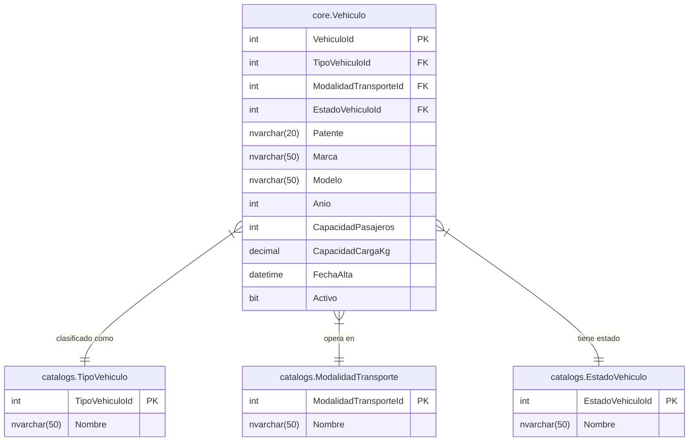

# Diagrama Entidad-Relación

## Modelo Relacional (Mermaid)

```mermaid
erDiagram
    %% Schemas: core, catalogs

    "core.Vehiculo" {
        int VehiculoId PK
        int TipoVehiculoId FK
        int ModalidadTransporteId FK
        int EstadoVehiculoId FK
        nvarchar(20) Patente
        nvarchar(50) Marca
        nvarchar(50) Modelo
        int Anio
        int CapacidadPasajeros
        decimal CapacidadCargaKg
        datetime FechaAlta
        bit Activo
    }

    "catalogs.TipoVehiculo" {
        int TipoVehiculoId PK
        nvarchar(50) Nombre
    }

    "catalogs.ModalidadTransporte" {
        int ModalidadTransporteId PK
        nvarchar(50) Nombre
    }

    "catalogs.EstadoVehiculo" {
        int EstadoVehiculoId PK
        nvarchar(50) Nombre
    }

    "core.Vehiculo" }|--|| "catalogs.TipoVehiculo" : "clasificado como"
    "core.Vehiculo" }|--|| "catalogs.ModalidadTransporte" : "opera en"
    "core.Vehiculo" }|--|| "catalogs.EstadoVehiculo" : "tiene estado"
```
