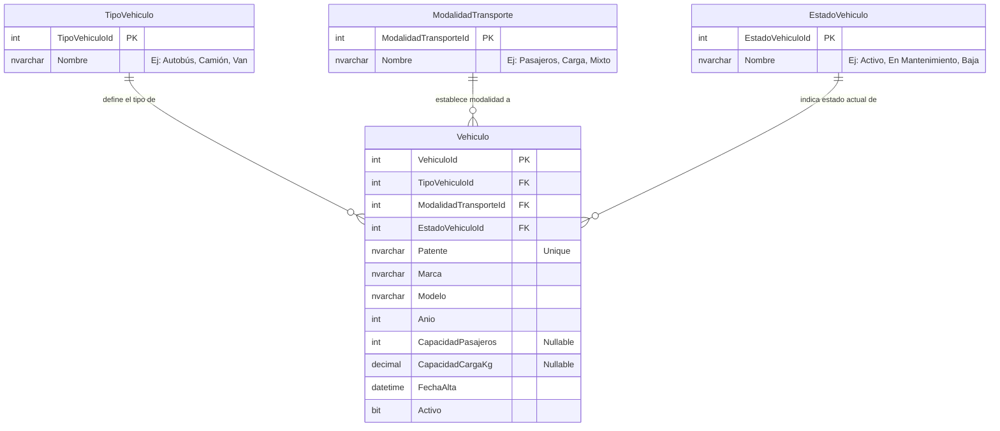

# Diagrama Entidad-Relación (ERD)

Este diagrama representa la estructura actual de la base de datos "Transporte Flota". Se actualiza a medida que evoluciona el modelado.

## Leyenda
- **PK**: Primary Key (Llave Primaria)
- **FK**: Foreign Key (Llave Foránea)
- **catalogs**: Esquema para datos estáticos.
- **core**: Esquema para datos principales del negocio.
