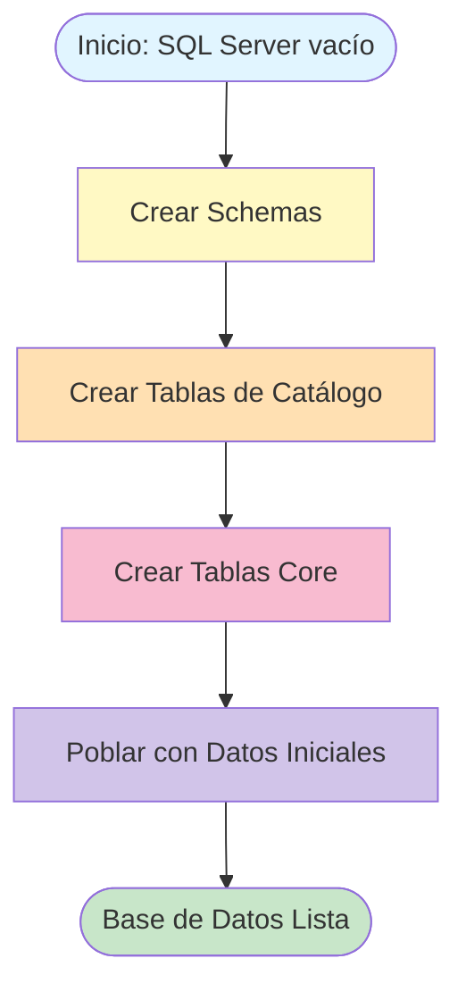
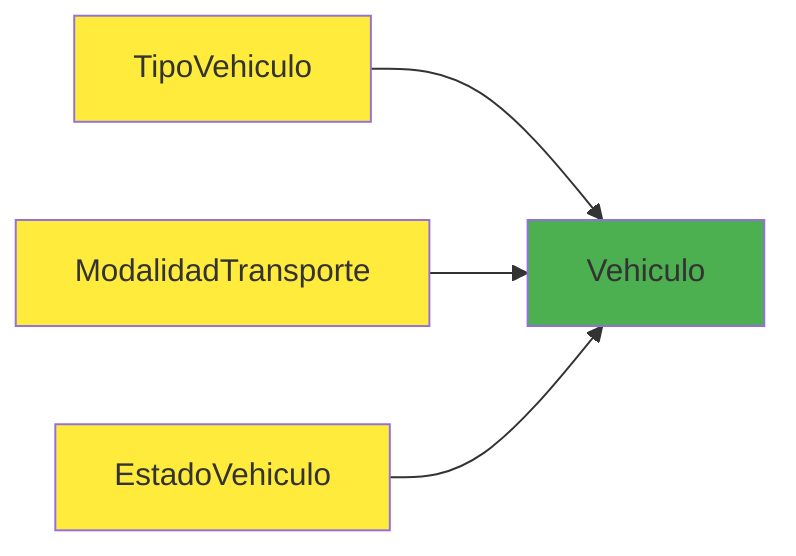
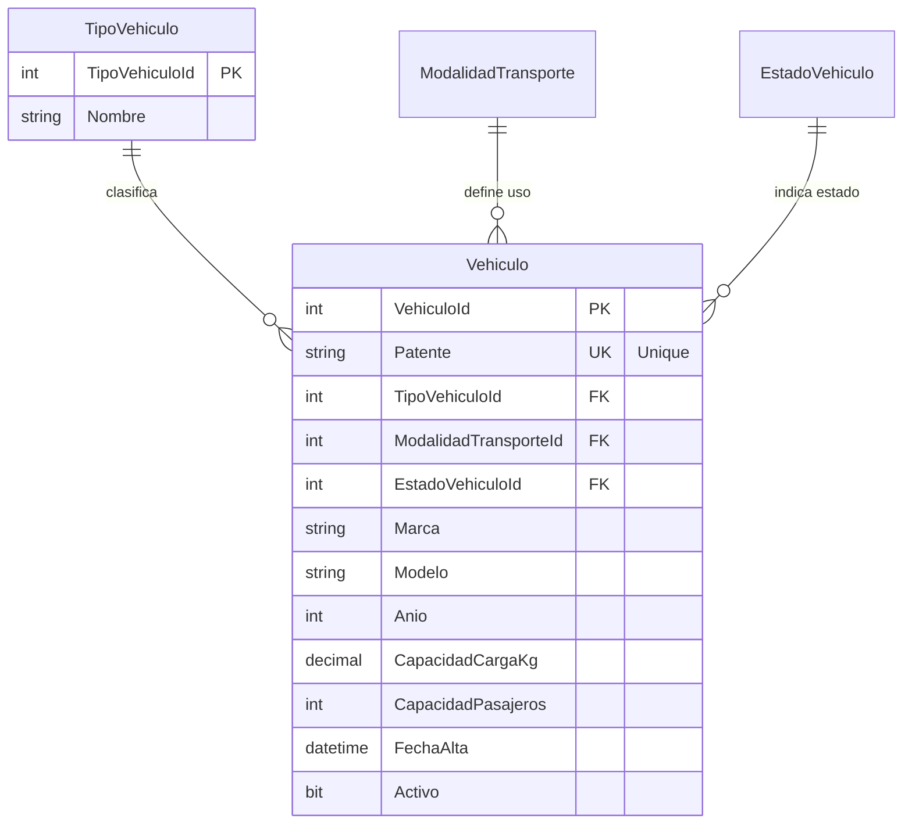
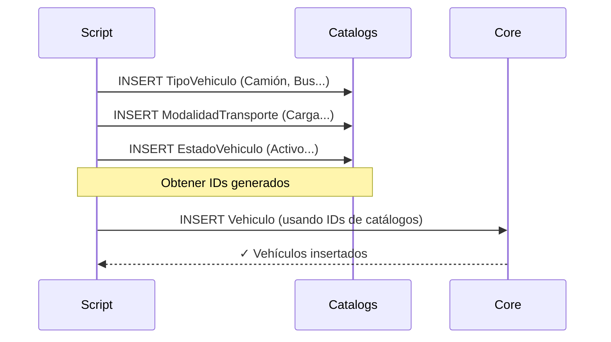
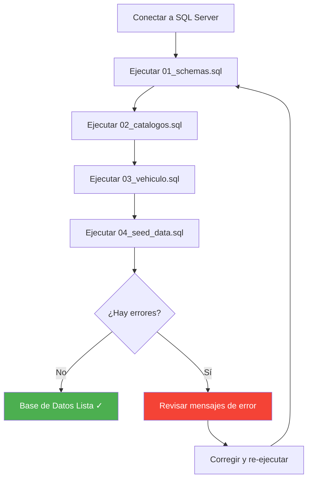

# Guía de Implementación: Base de Datos Transporte

Esta guía documenta el proceso completo de creación y poblado de la base de datos, desde cero hasta un entorno operativo con datos de prueba.

---

## 📐 Arquitectura Lógica



---

## 🔨 Paso 1: Creación de Schemas

### Concepto
Los **schemas** son contenedores lógicos que organizan objetos de base de datos (tablas, vistas, procedimientos). Similares a "carpetas" dentro de la base de datos.

### Por qué lo hacemos
*   Separar responsabilidades (catálogos vs datos transaccionales).
*   Facilitar permisos granulares (ej: rol de solo lectura en `catalogs`).
*   Mejorar la mantenibilidad a largo plazo.

### Script: `01_schemas.sql`

```sql
-- Creación de Schemas
IF NOT EXISTS (SELECT * FROM sys.schemas WHERE name = 'core')
BEGIN
    EXEC('CREATE SCHEMA [core]')
END
GO

IF NOT EXISTS (SELECT * FROM sys.schemas WHERE name = 'catalogs')
BEGIN
    EXEC('CREATE SCHEMA [catalogs]')
END
GO
```

### Resultado Esperado
*   2 schemas creados: `core` y `catalogs`.
*   Sin errores si se ejecuta múltiples veces (idempotente).

---

## 📋 Paso 2: Tablas de Catálogo (Datos Maestros)

### Concepto
Las **tablas de catálogo** almacenan valores de referencia que cambian raramente. Son el equivalente a "enums" pero en la base de datos.

### Diagrama de Dependencias



### Script: `02_catalogos.sql`

#### Tabla 1: TipoVehiculo
**Propósito**: Clasificar vehículos (Camión, Autobús, Furgoneta).

```sql
CREATE TABLE [catalogs].[TipoVehiculo](
    [TipoVehiculoId] [int] IDENTITY(1,1) NOT NULL,
    [Nombre] [nvarchar](50) NOT NULL,
    CONSTRAINT [PK_TipoVehiculo] PRIMARY KEY CLUSTERED ([TipoVehiculoId] ASC)
);
```

**Campos Clave**:
*   `IDENTITY(1,1)`: Autoincremental, SQL Server genera el ID automáticamente.
*   `CONSTRAINT PK_*`: Clave primaria, asegura unicidad.

---

#### Tabla 2: ModalidadTransporte
**Propósito**: Definir el uso del vehículo (Carga, Pasajeros, Mixto).

```sql
CREATE TABLE [catalogs].[ModalidadTransporte](
    [ModalidadTransporteId] [int] IDENTITY(1,1) NOT NULL,
    [Nombre] [nvarchar](50) NOT NULL,
    CONSTRAINT [PK_ModalidadTransporte] PRIMARY KEY CLUSTERED ([ModalidadTransporteId] ASC)
);
```

---

#### Tabla 3: EstadoVehiculo
**Propósito**: Estado operativo (Activo, En Mantenimiento, Baja).

```sql
CREATE TABLE [catalogs].[EstadoVehiculo](
    [EstadoVehiculoId] [int] IDENTITY(1,1) NOT NULL,
    [Nombre] [nvarchar](50) NOT NULL,
    CONSTRAINT [PK_EstadoVehiculo] PRIMARY KEY CLUSTERED ([EstadoVehiculoId] ASC)
);
```

### Resultado Esperado
*   3 tablas creadas en el schema `catalogs`.
*   Todas vacías (sin filas), listas para recibir datos.

---

## 🚗 Paso 3: Tabla Core - Vehículo

### Concepto
Esta es la tabla **central** del sistema. Contiene el inventario real de la flota.

### Diagrama Entidad-Relación



### Script: `03_vehiculo.sql`

```sql
CREATE TABLE [core].[Vehiculo](
    [VehiculoId] [int] IDENTITY(1,1) NOT NULL,
    [TipoVehiculoId] [int] NOT NULL,
    [ModalidadTransporteId] [int] NULL,
    [EstadoVehiculoId] [int] NOT NULL,
    [Patente] [nvarchar](20) NOT NULL,
    [Marca] [nvarchar](50) NULL,
    [Modelo] [nvarchar](50) NULL,
    [Anio] [int] NULL,
    [CapacidadPasajeros] [int] NULL,
    [CapacidadCargaKg] [decimal](10, 2) NULL,
    [FechaAlta] [datetime] DEFAULT GETDATE(),
    [Activo] [bit] DEFAULT 1,
    
    CONSTRAINT [PK_Vehiculo] PRIMARY KEY CLUSTERED ([VehiculoId] ASC),
    
    -- Claves Foráneas (Foreign Keys)
    CONSTRAINT [FK_Vehiculo_TipoVehiculo] FOREIGN KEY([TipoVehiculoId])
        REFERENCES [catalogs].[TipoVehiculo] ([TipoVehiculoId]),
    
    CONSTRAINT [FK_Vehiculo_ModalidadTransporte] FOREIGN KEY([ModalidadTransporteId])
        REFERENCES [catalogs].[ModalidadTransporte] ([ModalidadTransporteId]),
    
    CONSTRAINT [FK_Vehiculo_EstadoVehiculo] FOREIGN KEY([EstadoVehiculoId])
        REFERENCES [catalogs].[EstadoVehiculo] ([EstadoVehiculoId])
);
```

### Decisiones de Diseño

| Campo | Nullable | Justificación |
|:---|:---|:---|
| `Patente` | NO | Obligatorio, es el identificador real del vehículo. |
| `Marca`, `Modelo` | SÍ | Pueden desconocerse en vehículos viejos sin documentación. |
| `CapacidadPasajeros` | SÍ | NULL si es vehículo de carga pura. |
| `CapacidadCargaKg` | SÍ | NULL si es vehículo de pasajeros sin bodega. |

### Resultado Esperado
*   1 tabla `Vehiculo` creada con 3 Foreign Keys activas.
*   No se puede insertar un vehículo con tipo inexistente (la FK lo previene).

---

## 🌱 Paso 4: Poblar con Datos Iniciales (Seed)

### Concepto
Un **seed script** inserta datos de prueba reales para que la base de datos sea inmediatamente operativa.

### Flujo de Inserción



### Script: `04_seed_data.sql`

#### Parte 1: Catálogos

```sql
-- Poblar TipoVehiculo
INSERT INTO [catalogs].[TipoVehiculo] (Nombre)
SELECT 'Camión' WHERE NOT EXISTS (SELECT 1 FROM [catalogs].[TipoVehiculo] WHERE Nombre = 'Camión')
UNION ALL
SELECT 'Furgoneta' WHERE NOT EXISTS (SELECT 1 FROM [catalogs].[TipoVehiculo] WHERE Nombre = 'Furgoneta')
UNION ALL
SELECT 'Autobús' WHERE NOT EXISTS (SELECT 1 FROM [catalogs].[TipoVehiculo] WHERE Nombre = 'Autobús');
```

**Por qué `WHERE NOT EXISTS`:**
*   Evita duplicados si ejecutas el script 2 veces.
*   Permite reparar la base de datos sin romperla.

---

#### Parte 2: Vehículos (Estrategia Dinámica)

```sql
-- Obtener IDs sin hardcodear
DECLARE @TipoCamion INT = (SELECT TOP 1 TipoVehiculoId FROM [catalogs].[TipoVehiculo] WHERE Nombre = 'Camión');
DECLARE @ModCarga INT = (SELECT TOP 1 ModalidadTransporteId FROM [catalogs].[ModalidadTransporte] WHERE Nombre = 'Carga General');
DECLARE @EstadoActivo INT = (SELECT TOP 1 EstadoVehiculoId FROM [catalogs].[EstadoVehiculo] WHERE Nombre = 'Activo');

-- Insertar Vehículo
IF NOT EXISTS (SELECT 1 FROM [core].[Vehiculo] WHERE Patente = 'AA-123-BB')
BEGIN
    INSERT INTO [core].[Vehiculo] 
    (TipoVehiculoId, ModalidadTransporteId, EstadoVehiculoId, Patente, Marca, Modelo, Anio, CapacidadCargaKg)
    VALUES 
    (@TipoCamion, @ModCarga, @EstadoActivo, 'AA-123-BB', 'Volvo', 'FH16', 2023, 25000.00);
END
```

**Por qué variables en lugar de IDs fijos:**
*   Si borras un catálogo y lo recrear, los IDs cambian.
*   Este script funciona siempre porque busca por nombre lógico.

### Resultado Esperado
*   Catálogos poblados con 4 tipos, 4 modalidades, 4 estados.
*   3 vehículos insertados (Camión, Bus, Furgoneta).

---

## ✅ Checklist de Verificación

Después de ejecutar los 4 scripts, verifica:

```sql
-- ¿Cuántos schemas hay?
SELECT name FROM sys.schemas WHERE name IN ('core', 'catalogs');
-- Resultado esperado: 2 filas

-- ¿Cuántas tablas hay?
SELECT TABLE_SCHEMA, TABLE_NAME FROM INFORMATION_SCHEMA.TABLES WHERE TABLE_SCHEMA IN ('core', 'catalogs');
-- Resultado esperado: 4 filas (3 catálogos + 1 core)

-- ¿Cuántos vehículos hay?
SELECT COUNT(*) FROM core.Vehiculo;
-- Resultado esperado: 3 vehículos
```

---

## 🔄 Proceso Completo (Orden de Ejecución)



---

## 🎓 Conceptos Técnicos Aplicados

| Concepto | Dónde se usa | Beneficio |
|:---|:---|:---|
| **Idempotencia** | `IF NOT EXISTS` en todos los scripts | Scripts seguros para re-ejecutar |
| **Foreign Keys** | `Vehiculo → TipoVehiculo` | Integridad referencial |
| **Schemas** | `core.Vehiculo`, `catalogs.TipoVehiculo` | Organización lógica |
| **Identity** | `IDENTITY(1,1)` | IDs autogenerados |
| **Default Values** | `DEFAULT GETDATE()` | Valores automáticos |
| **Variables Dinámicas** | `DECLARE @TipoCamion` | Evitar IDs hardcodeados |

---

## 🚀 Estado Actual del Proyecto

Una vez completada esta guía, tendrás:

- ✅ Estructura de base de datos lista (3 schemas: core, catalogs, media).
- ✅ 3 vehículos de ejemplo con datos reales.
- ✅ Sistema de gestión de fotografías (preparado para AWS S3).
- ✅ Posibilidad de ejecutar queries de BI.

### Siguientes Fases (Roadmap)

**Fase 2 – El Factor Humano:**
- Agregar entidad `Conductor` con datos personales.
- Tabla `LicenciaConducir` con fechas de vencimiento.
- Relación `Vehiculo-Conductor` (asignaciones).

**Fase 3 – Operación:**
- Implementar `Viajes` y `HojaRuta`.
- Tracking GPS en esquema `tracking`.

**Fase 4 – Automatización:**
- Crear Stored Procedures para operaciones comunes.
- Triggers para auditoría automática.
- Views materializadas para reportes frecuentes.
